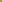
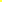
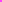

🖌️ Delightfully simple terminal text styles.

`@coven/terminal` uses [ANSI escape codes][ansi-escape-code] to format CLI text
background, color and style. The utils can be used as tag functions for
[template literals][template-literals] like this:

```typescript
import { bold, red } from "cuterminal";

onsole.log(red`Hello ${bold`world`}!`);
// ^ Logs "Hello world!" in red text with the word "world" in bold.
```

## Available Functions

All functions in this library can be used directly, or like template literal tag
functions:

```typescript
bold("Example") === bold`Example`;
```

### Color Functions

These functions set the foreground and background color of a string. The full
list of available foreground and background functions:

| Color                                                 | Foreground      | Background          |
| ----------------------------------------------------- | --------------- | ------------------- |
|  Black                           | `black`         | `blackBack`         |
|  White                           | `white`         | `whiteBack`         |
|  Gray                              | `gray`          | `grayBack`          |
|  Bright Gray          | `brightGray`    | `brightGrayBack`    |
|  Red                                 | `red`           | `redBack`           |
|  Bright Red             | `brightRed`     | `brightRedBack`     |
|  Yellow                        | `yellow`        | `yellowBack`        |
|  Bright Yellow    | `brightYellow`  | `brightYellowBack`  |
|  Green                           | `green`         | `greenBack`         |
|  Bright Green       | `brightGreen`   | `brightGreenBack`   |
|  Cyan                              | `cyan`          | `cyanBack`          |
|  Bright Cyan          | `brightCyan`    | `brightCyanBack`    |
|  Blue                              | `blue`          | `blueBack`          |
|  Bright Blue          | `brightBlue`    | `brightBlueBack`    |
|  Magenta                     | `magenta`       | `magentaBack`       |
|  Bright Magenta | `brightMagenta` | `brightMagentaBack` |

### Style Functions

These functions apply various text styles:

| Style                 | Function        |
| --------------------- | --------------- |
| **Bold**              | `bold`          |
| Dimmed                | `dimmed`        |
| Inverse               | `inverse`       |
| _Italic_              | `italic`        |
| ~~Strikethrough~~     | `strikethrough` |
| <ins>Underlined</ins> | `underlined`    |

### Mix Function

The library includes a `mix` function that can be used to mix several utils:

```typescript
const boldRedWhiteBack = mix(bold, red, whiteBack);

boldRedWhiteBack`Coven Engineering`; // The string "Coven Engineering", with bold style, red color and white background
```

<!-- Reference -->

[ansi-escape-code]: https://en.wikipedia.org/wiki/ANSI_escape_code
[template-literals]: https:/mdn.io/Template_literals
